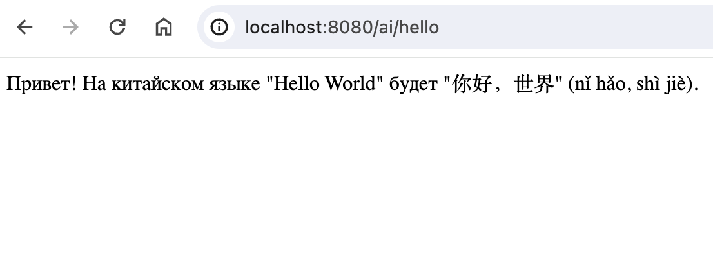
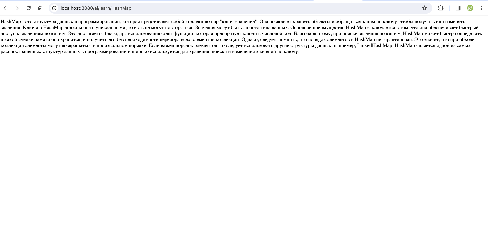

# Проект "testai"

Это простой проект, демонстрирующий использование Spring Boot для работы с искусственным интеллектом (AI).
Для правильной работы проекта, необходим VPN. В вайд application.properties необходимо добавить ключ, полученный у 
ChatGPT.

Пример: spring.ai.openai.api-key=ваш_секретный_ключ

## Использование API

### Получить приветственное сообщение

Отправьте GET-запрос: http://localhost:8080/ai/hello

### Вывод:

### Реализация PromptTemplate

Отправьте GET-запрос: http://localhost:8080/ai/learn/HashMap

### Вывод:

